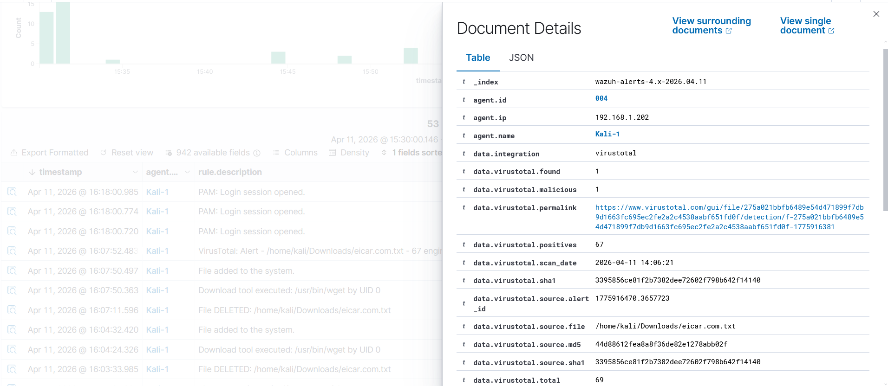

# Enterprise-SOC-Web-Defense-Automation-Wazuh-SIEM-

### 📌 Project Overview

This project showcases a fully automated Security Operations Center (SOC) built on Wazuh SIEM. It integrates endpoint protection, network monitoring, and web application security into a single pane of glass, mapped to the MITRE ATT&CK framework.

### 🏗️ Architecture & Lab Setup

* SIEM Stack: Containerized Wazuh (Manager, Indexer, Dashboard).

* Endpoints: Windows Server 2022, Windows 10/11, and Kali Linux.

* Monitored Grouping: Specialized policies for Linux and Windows agents.

### 🚀 Quick Navigation

To get this project running in your environment, follow the dedicated guides below:

* Installation Guide: Automated scripts for Docker and Native deployment.

* Detection Rules: The core ruleset for threat detection.

* Custom Decoders: Logic for parsing specialized log formats.

### 🌐 Web Application Security (WAF Mode)

I integrated DVWA (Damn Vulnerable Web App) to simulate and detect real-world web attacks.
1. SQL Injection (SQLi)

    Detection: Identified malicious SQL payloads in Apache logs.

    Alert: Rule 31164 - SQL injection attempt.
   

3. Cross-Site Scripting (XSS)

    Scenarios: Reflected and DOM-based XSS attacks.

    Custom Rule: Developed Rule 102010 (Level 10) for high-accuracy XSS detection.

    Alert: Rule 102010 - XSS attempt detected.
   
   

5. Local File Inclusion (LFI)

    Detection: Captured directory traversal attempts (/etc/passwd).

    Alert: Rule 102020 (Level 12 severity).
   
   

### 🔍 Threat Intelligence & Malware Analysis

1. VirusTotal Integration

    Workflow: Wazuh automatically extracts file hashes and queries VirusTotal.

    Finding: Detected EICAR test malware with a 66/68 malicious score.
   
   
   
   

3.  MITRE ATT&CK® Framework Mapping

All custom rules and alerts are mapped to MITRE ATT&CK techniques (e.g., Persistence, Privilege Escalation, Brute Force), allowing for a standardized understanding of adversary behavior.

| Rule ID Range | MITRE Technique | Tactic |
| :--- | :--- | :--- |
| **100041 - 100046** | T1546, T1547 | Persistence |
| **100100 - 100152** | T1110, T1078 | Initial Access |
| **100200 - 100400** | T1003, T1055 | Credential Access, Defense Evasion |
| **100600** | T1091 | Initial Access (Replication Through Removable Media) |
| **101100 - 101191** | T1620, T1611 | Defense Evasion, Privilege Escalation |
| **101200 - 101262** | T1110, T1114 | Initial Access, Collection |
| **101310** | T1021, T1071 | Command and Control (Non-TTY Session) |
| **101320 - 101322** | T1548 | Privilege Escalation (Sudo/Abuse) |
| **101330 - 101332** | T1136 | Persistence (Create Account) |
| **101340 - 101341** | T1222 | Defense Evasion (File Permissions) |
| **101400 - 101440** | T1014, T1564 | Defense Evasion (Rootkit/Hidden Files) |
| **101500 - 101511** | T1021, T1570 | Lateral Movement |
| **102010 - 102030** | T1059, T1190 | Execution, Initial Access (Web Attacks) |

### 🛡️ Advanced Detection Logic (The Brain)

My custom ruleset consists of 80+ specialized detection rules, designed to reduce false positives and provide high-fidelity alerts. These rules are mapped to the MITRE ATT&CK matrix, covering the full attack lifecycle.

| Group (Category) |Rules Numbers (Count) |  IDs (Range) |
| :--- | :---: | :--- |
| **FIM File Operations** | 5 | 100041 - 100046 |
| **Remote Access Monitoring (RDP & SSH)** | 6 | 100100 - 100152 |
| **Windows Advanced Threats** | 8 | 100200 - 100400 |
| **USB Monitoring** | 1 | 100600 |
| **Auditd Advanced Rules** | 15 | 101100 - 101191 |
| **Fraud Detection** | 20 | 101200 - 101262 |
| **Session Anomalies** | 1 | 101310 |
| **Sudo/Privilege Escalation** | 3 | 101320 - 101322 |
| **User Account Changes** | 3 | 101330 - 101332 |
| **Group/Permission Changes** | 2 | 101340 - 101341 |
| **File Integrity & System Integrity** | 11 | 101400 - 101440 |
| **Network Security & Lateral Movement** | 2 | 101500 - 101511 |
| **Web Security** | 2 | 102010 - 102020 |

1. FIM File Operations (6 Rules)

| Rule ID | Name | Description | Severity |
| :--- | :--- | :--- | :---: |
| **100041** | Critical File Modified | Detects changes to `/etc/passwd`, `/etc/shadow`, system binaries | 13 |
| **100042** | SUID Binary Added | New SUID/SGID file detected (Potential privilege escalation) | 12 |
| **100043** | Web Shell Upload | PHP/JSP/ASPX file uploaded to web directories | 14 |
| **100044** | Cron Persistence | New cron job added to system or user crontabs | 11 |
| **100045** | Startup Script Modified | Changes to `/etc/rc.local`, systemd services, init.d | 10 |
| **100046** | SSH Key Authorized_keys | New SSH key added to `authorized_keys` file | 12 |
2. Remote Access Monitoring - RDP & SSH (5 Rules)

| Rule ID | Name | Description | Severity |
| :--- | :--- | :--- | :---: |
| **100100** | RDP Brute Force | 5+ failed RDP logins within 5 minutes | 10 |
| **100101** | RDP Successful After Brute | Successful RDP login after multiple failures (Account Takeover) | 12 |
| **100150** | SSH Connection from New Country | SSH login from geolocation not seen in 30 days | 8 |
| **100151** | SSH Off-Hours Login | SSH login outside business hours (weekend/night) | 6 |
| **100152** | SSH Root Login Enabled | Direct root login via SSH detected | 14 |

3. Windows Advanced Threats (8 Rules)

| Rule ID | Name | Description | Severity |
| :--- | :--- | :---: | :---: |
| **100200** | LSASS Memory Access | Process attempting to access `lsass.exe` (Mimikatz style) | 15 |
| **100201** | SAM Database Dump | Attempt to read SAM/SYSTEM/SECURITY registry hives | 15 |
| **100202** | PowerShell Obfuscation | Base64 encoded or obfuscated PowerShell commands detected | 12 |
| **100203** | WMI Event Subscription | Persistence via WMI event consumer insertion | 11 |
| **100204** | Scheduled Task Creation | New scheduled task created via `schtasks` or XML | 9 |
| **100205** | Service Creation | New Windows service installed (Persistence/Privilege Escalation) | 10 |
| **100206** | Process Injection | Detects `CreateRemoteThread` or Process Hollowing techniques | 14 |
| **100400** | DCsync Attack | Directory Replication Service access from a non-Domain Controller | 15 |

4. USB Monitoring (1 Rule)

| Rule ID | Name | Description | Severity |
| :--- | :--- | :--- | :---: |
| **100600** | USB Device Connected | Unauthorized USB storage device plugged into a monitored host | 8 |

5. Auditd Advanced Rules (15 Rules)

| Rule ID | Name | Description | Severity |
| :--- | :--- | :--- | :---: |
| **101100** | Syscall Anomaly - ptrace | Process tracing/debugging detected (Potential code injection) | 10 |
| **101101** | Kernel Module Loaded | `insmod`/`modprobe` execution detected (Potential Rootkit) | 11 |
| **101102** | BPF Program Loaded | eBPF program loaded (Advanced stealth/rootkit indicator) | 13 |
| **101103** | Container Escape - cgroup | cgroup breakout attempt detected from within a container | 14 |
| **101104** | Container Escape - privileged | Privileged container escape attempt via `mknod` | 14 |
| **101105** | Docker Socket Access | Unauthorized container access to `/var/run/docker.sock` | 12 |
| **101106** | Capabilities Added | Process adding dangerous capabilities (e.g., `CAP_SYS_ADMIN`) | 11 |
| **101107** | Namespace Manipulation | `setns()` syscall usage for namespace escape | 12 |
| **101108** | Seccomp Bypass | Attempt to bypass seccomp security filters | 13 |
| **101109** | Core Dump Generated | Sensitive process crashed (Potential memory/password extraction) | 9 |
| **101110** | TTY Shell Spawned | Interactive shell spawned via script/expect (Post-Exploitation) | 10 |
| **101111** | Hidden Process (LD_PRELOAD) | `LD_PRELOAD` environment variable used to hook system calls | 12 |
| **101190** | Reconnaissance - System Info | `uname`, `hostname`, `id` commands executed in rapid sequence | 5 |
| **101191** | Reconnaissance - Network | `netstat`, `ss`, `lsof` usage for internal network discovery | 5 |

6. Fraud & Advanced Behavioral Detection (20 Rules)

| Rule ID | Name | Description | Severity |
| :--- | :--- | :--- | :---: |
| **101200** | Account Takeover | Successful login immediately following 3+ failures (60s window) | 12 |
| **101201** | Impossible Travel | Login detected from 2 distinct locations within impossible time | 11 |
| **101202** | Credential Stuffing | Multiple failed logins with different users from a single IP | 10 |
| **101203** | New Device Login | First-time login detected from an unrecognized device fingerprint | 7 |
| **101204** | Password Spray Attack | Multiple usernames targeted with the same password pattern | 10 |
| **101205** | MFA Bypass Attempt | Multiple MFA failures followed by a suspicious success | 13 |
| **101206** | Session Hijacking | Active session cookie/token reuse from a different IP/User-Agent | 12 |
| **101207** | Carding Attempt | Multiple payment failures using different card numbers | 9 |
| **101208** | Bonus Abuse | Multiple account registrations originating from the same device | 8 |
| **101212** | Data Exfiltration - Archive | `.zip`/`.tar` creation in sensitive or unusual directories | 11 |
| **101216** | Container Breakout | `chroot` escape or `/proc` filesystem escape attempt | 14 |
| **101260** | Crypto Mining - CPU | Sustained high CPU usage linked to known mining pool IPs | 10 |
| **101262** | Ransomware File Activity | Mass file renaming/encryption (`.encrypted`, `.locked`, `.crypt`) | 15 |

7. Session & Privilege Escalation (4 Rules)

| Rule ID | Name | Description | Severity |
| :--- | :--- | :--- | :---: |
| **101310** | Stealth Login (No TTY) | Login without a TTY (Highly indicative of reverse shells/bots) | 12 |
| **101320** | Sudo Command Executed | Detailed logging of all sudo command executions | 4 |
| **101321** | Sudoers File Modified | Unauthorized edit of `/etc/sudoers` or using `visudo` | 13 |
| **101322** | Sudo Exploit Attempt | Detection of known CVE exploits (e.g., CVE-2021-3156) | 15 |

8. Sudo & Privilege Escalation (3 Rules)

| Rule ID | Name | Description | Severity |
| :--- | :--- | :--- | :---: |
| **101320** | Sudo Command Executed | General logging of all `sudo` command executions | 4 |
| **101321** | Sudoers File Modified | Detection of `visudo` or direct edits to `/etc/sudoers` | 13 |
| **101322** | Sudo Exploit Attempt | Detection of known CVE exploits (e.g., Baron Samedit CVE-2021-3156) | 15 |

9. User Account & Group Changes (5 Rules)

| Rule ID | Name | Description | Severity |
| :--- | :--- | :--- | :---: |
| **101330** | User Added | `useradd` or `adduser` command executed | 8 |
| **101331** | User Deleted | `userdel` command executed | 9 |
| **101332** | Password Changed | `passwd` command targeting root or administrative accounts | 7 |
| **101340** | Group Modified | `usermod -g` or `groupadd` execution | 7 |
| **101341** | File Permission Changed | Critical permission changes like `chmod 777` or SUID `+s` | 10 |

10. File & System Integrity (11 Rules)

| Rule ID | Name | Description | Severity |
| :--- | :--- | :--- | :---: |
| **101400** | System Binary Modified | Hash change detected in `/bin`, `/sbin`, or `/usr/bin` | 15 |
| **101401** | Library Injection | `LD_LIBRARY_PATH` modification or suspicious `.so` files | 11 |
| **101402** | Kernel Module Modified | Unauthorized changes in `/lib/modules` (Rootkit indicator) | 13 |
| **101403** | Bootloader Modified | GRUB or MBR tampering detected | 14 |
| **101404** | PAM Configuration Changed | Modifications to `/etc/pam.d/` (Authentication bypass) | 12 |
| **101407** | Log Tampering | Deletion or unauthorized modification of `/var/log` files | 13 |
| **101408** | Audit Log Cleared | Attempts to clear logs via `auditctl` or logrotate abuse | 14 |
| **101440** | Rootkit Indicator | Process binding to privileged ports (<1024) without permission | 12 |

11. Network Security & Lateral Movement (2 Rules)

| Rule ID | Name | Description | Severity |
| :--- | :--- | :--- | :---: |
| **101500** | SMB/Windows Admin Share | Access to administrative shares (ADMIN$, C$, IPC$) | 10 |
| **101511** | PsExec Execution | Detection of `PsExec` or similar remote execution tools | 12 |

12. Web Application Security (3 Rules)

| Rule ID | Name | Description | Severity |
| :--- | :--- | :--- | :---: |
| **102010** | XSS Precision | Detection of `` after the website URL.
* "To test the SQL Injection rule, type ' OR 1=1 #
* To test the XSS DOM rule, when choose Language and replace Language for this text >  '' .
* Hash theft (Dumping Hashes) - (Rule 101142)  > sudo cat /etc/shadow
* The attacker is trying to find out the usernames on the system: (Run Rule 101141) > cat /etc/passwd OR grep "root" /etc/passwd .
* #Network Scanner  (nmap , masscan, Wireshark ,  tcpdump )  > nmap -sS 127.0.0.1 - masscan 127.0.0.1 -p80 - sudo tcpdump -c 5 -i lo .
* Download Test curl http://google.com - wget http://google.com - for i in {1..6}; do curl http://google.com; sleep 1; done .
* Test Shadow file(Password)  > sudo auditctl -w /etc/shadow -p r -k shadow_access

### 👨‍💻 Author

### Youssef Mohamed
### Cybersecurity / SOC Analyst
### [GitHub Profile](https://github.com/youssefmohamed180497-code)

I will update rules and decoders if the projects I work on require them.

