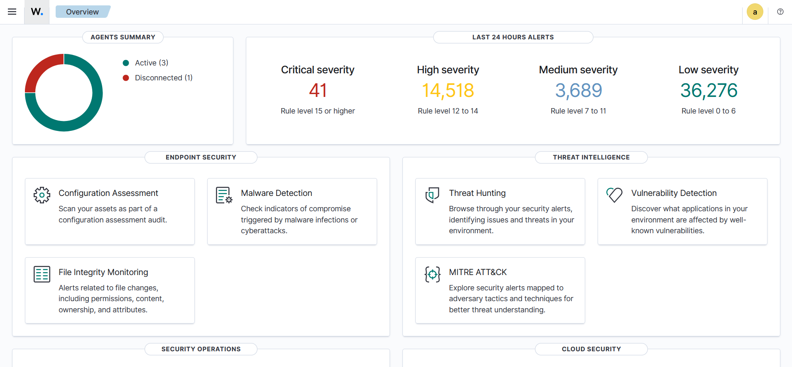

# Enterprise-SOC-Web-Defense-Automation-Wazuh-SIEM-

📌 Project Overview

This project showcases a fully automated Security Operations Center (SOC) built on Wazuh SIEM. It integrates endpoint protection, network monitoring, and web application security into a single pane of glass, mapped to the MITRE ATT&CK framework.

🏗️ Architecture & Lab Setup

SIEM Stack: Containerized Wazuh (Manager, Indexer, Dashboard).
Endpoints: Windows Server 2022, Windows 10/11, and Kali Linux.
Monitored Grouping: Specialized policies for Linux and Windows agents.

🌐 Web Application Security (WAF Mode)

I integrated DVWA (Damn Vulnerable Web App) to simulate and detect real-world web attacks.
1. SQL Injection (SQLi)

    Detection: Identified malicious SQL payloads in Apache logs.

    Alert: Rule 31164 - SQL injection attempt.

2. Cross-Site Scripting (XSS)

    Scenarios: Reflected and DOM-based XSS attacks.

    Custom Rule: Developed Rule 102010 (Level 10) for high-accuracy XSS detection.

    Alert: Rule 102010 - XSS attempt detected.

3. Local File Inclusion (LFI)

    Detection: Captured directory traversal attempts (/etc/passwd).

    Alert: Rule 102020 (Level 12 severity).

🔍 Threat Intelligence & Malware Analysis

1. VirusTotal Integration

    Workflow: Wazuh automatically extracts file hashes and queries VirusTotal.

    Finding: Detected EICAR test malware with a 66/68 malicious score.

2.  MITRE ATT&CK® Framework Mapping

All custom rules and alerts are mapped to MITRE ATT&CK techniques (e.g., Persistence, Privilege Escalation, Brute Force), allowing for a standardized understanding of adversary behavior.

🛡️ Advanced Detection Logic (The Brain)
My custom ruleset consists of 80+ specialized detection rules, designed to reduce false positives and provide high-fidelity alerts. These rules are mapped to the MITRE ATT&CK matrix, covering the full attack lifecycle.
1. Web Application Defense (L7/WAF Logic)

    XSS Precision (Rule 102010): Instead of generic web alerts, this rule specifically identifies script tags and alert functions in decoded URLs.

    Path Traversal (Rule 102020): High-severity (Level 12) rule for identifying attempts to break out of the web root (e.g., /etc/passwd).

    SQLi Detection (Rule 102030): Targets specific SQL syntax keywords like UNION SELECT and -- #.

2. Identity & Access Management (IAM)

    Critical Account Takeover (Rule 101200): A correlation rule that identifies a successful login only after 3+ failures from the same source within 60s.

    SSH Brute Force (Rule 101180): Aggregates failed login attempts to flag automated scanners.

    Stealth Login Detection (Rule 101310): Detects logins without a TTY (Typical of automated tunneling or reverse shells).

3. Endpoint Forensics & EDR Logic

    FIM Persistence (Rules 100041 - 100046): Monitors the system for file additions and permission changes, identifying potential backdoors.

    Archive Creation (Rule 101212): Detects creation of .zip or .tar files in sensitive areas, a common sign of Data Exfiltration.

    Malware Detection (VT Integration): Rules that trigger an automated VirusTotal scan whenever a new file hash is detected by the FIM engine.

4. System Health & Compliance

    CIS Benchmarking (Rule 19004): Automated alerts for systems falling below 50% compliance with security standards.

    Auditd Anomaly Detection: Custom decoders for Linux syscalls to monitor unauthorized sudo usage and privilege escalation attempts.

📊 Detection Logic Strategy
How I Optimized the 80 Rules:

1-Noise Reduction: By using if_sid and if_group, I ensure that high-level alerts only fire when a baseline of suspicious activity is met. "Implemented parent-child rule relationships to suppress repetitive noise and only escalate verified attack chains.".

2-Severity Scoring: Rules are weighted based on risk. For example, a failed login is Level 5, but a Brute Force Success is Level 12.

3-Cross-Platform Visibility: Rules are designed to cover both Windows (Sysmon) and Linux (Auditd/Suricata) simultaneously.

⚠️ Incident Alerting

Critical Alerts: Level 15 alerts trigger automated SMTP email notifications for immediate response.

Resource Monitoring: Real-time alerting on system health and memory exhaustion.
    
🚀 Key Use Cases Verified

Malware Detection: Identified the EICAR test string and verified its malicious reputation via VirusTotal.

Exploit Identification: Detected Python-based reverse shells and script-based network activity.

Brute Force Correlation: Successfully flagged automated SSH attacks and account takeover attempts.

I will update rules and decoders if the projects I work on require them.
